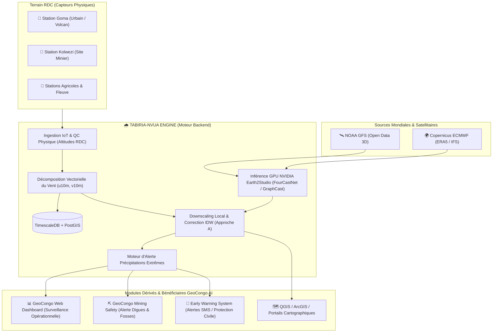

# 🌧️ Tabiria-Nvua Engine (`nvua-engine`)
> **Le Cœur d'Intelligence Météorologique, d'Assimilation IoT et d'Alerte aux Risques Climatiques Extrêmes de GeoCongo AI.**

[](https://fastapi.tiangolo.com)
[](https://python.org)
[](https://pytorch.org)
[](https://github.com/NVIDIA/earth2studio)
[](https://timescale.com)
[](https://www.docker.com)
[](#)

---

## 🌍 1. Vision & Place dans l'Écosystème GeoCongo AI

**GeoCongo AI** est une initiative technologique pionnière visant à doter la République Démocratique du Congo (RDC) et le Bassin du Congo d'outils souverains d'observation spatiale, d'intelligence artificielle et d'aide à la décision face aux défis climatiques, environnementaux et industriels.

Au sein de cet écosystème, **`Tabiria-Nvua Engine`** (« *Nvua* » ou « *Vula* » signifiant *la pluie*) est le **microservice moteur central (Backend Engine)** responsable de toute l'intelligence atmosphérique :
* Il ingère les prévisions numériques mondiales en 3D (satellites, modèles d'IA mondiaux).
* Il collecte en continu les télémesures des stations physiques au sol (mines, zones urbaines, concessions agricoles).
* Il calcule en temps réel les décalages microclimatiques locaux et alimente tous les autres sous-systèmes de GeoCongo AI via des API REST standardisées et des flux géospatiaux.

### 🏛️ Schéma d'Intégration de l'Écosystème GeoCongo AI



---

## 👥 2. Bénéficiaires & Cas d'Usage à Fort Impact en RDC

Tabiria-Nvua Engine n'est pas un simple outil météo grand public : c'est un **système critique d'aide à la décision et de résilience climatique**, taillé pour répondre aux défis spécifiques de la RDC :

### 1. ⛏️ Secteur Minier (Haut-Katanga, Lualaba, Sud-Kivu, Ituri)
* **Problématiques** : 
  * Inondation subite des fosses d'extraction à ciel ouvert arrêtant les opérations.
  * Risque de rupture des digues de rétention de résidus miniers toxiques (*tailing dams*) sous forte pluie.
  * Dégradation immédiate des pistes d'évacuation en latérite pour les camions de transport de cuivre/cobalt.
* **Valeur apportée** :
  * Anticipation à 24-72h des cumuls extrêmes (> 50 mm/24h) et des vents violents.
  * Planification préventive du pompage, sécurisation des bassins de décantation et des équipes de terrassement.

### 2. 🚨 Protection Civile, Urbanisme & Gestion des Catastrophes (Goma, Bukavu, Kinshasa, Uvira)
* **Problématiques** :
  * Crues éclairs dévastatrices et coulées de boue (ex: catastrophes de Kalehe, inondations régulières à Kalamu/N'djili à Kinshasa).
  * Pertes humaines massives et destructions d'infrastructures.
* **Valeur apportée** :
  * Système d'Alerte Précoce (*Early Warning System*) déclenchant des notifications d'évacuation d'urgence 6 à 18 heures avant le pic de crue.
  * Cartographie des zones d'intensité pluviométrique pour guider le déploiement des secours d'urgence.

### 3. 🌱 Agriculture & Sécurité Alimentaire
* **Problématiques** :
  * Perturbation des calendriers culturaux historiques, destruction des semis par lessivage ou périodes sèches non anticipées.
* **Valeur apportée** :
  * Prévision agro-météorologique ciblée permettant d'optimiser les dates de semis, d'épandage et de récolte pour les coopératives et grands domaines agro-industriels.

### 4. ⚡ Énergie & Hydro-électricité (Barrages d'Inga, Ruzizi, centrales locales)
* **Valeur apportée** :
  * Prévision des apports pluviométriques sur les bassins versants hydrographiques pour anticiper le débit des fleuves et réguler le turbinage sans risque d'engorgement.

---

## 🔬 3. Méthodologie Scientifique : Approche A (Phase 1)

Face aux contraintes économiques et d'infrastructure actuelles en RDC (faible densité initiale de stations physiques au sol), **Tabiria-Nvua Engine implémente l'Approche A (Downscaling & Correction de Biais)** :

### Pourquoi l'Approche A est la plus pragmatique et puissante ?
1. **Accès gratuit aux supercalculateurs mondiaux** :
   Les modèles météorologiques mondiaux par IA (*FourCastNet*, *GraphCast*) nécessitent des variables en 3 dimensions (température, humidité et géopotentiel sur 13 à 37 niveaux de pression atmosphérique : 1000, 850, 700, 500, 200 hPa).  
   Tabiria-Nvua Engine s'appuie sur le flux **NOAA GFS Open Data**, gratuit et mis à jour toutes les 6 heures par satellite.
2. **Inférence IA NVIDIA Earth2Studio** :
   Le modèle calcule la dynamique atmosphérique globale et génère une prévision spatiale à 0.25° (~25 km) de résolution.
3. **Extraction et Calibration Terrain (Downscaling Local / MOS)** :
   Le moteur extrait la maille exacte correspondant à la coordonnée cible (ex: Goma ou une mine). Si une station locale est enregistrée (ex: `STATION-GOMA-01`), le moteur calcule l'écart observé en surface et applique un coefficient correcteur inverse à la distance (IDW) avec un rayon d'influence maximal de 150 km.
4. **Résilience Maximale** :
   * **Avec 1 à 3 stations locales** : Le modèle ajuste les microclimats de ses stations pilotes.
   * **Avec 0 station locale dans la région** : Le moteur délivre sans interruption la prévision brute haute résolution d'Earth2Studio.

### 💨 Gestion Vectorielle du Vent ($u_{10m}, v_{10m}$)
Les modèles d'IA manipulent des champs de vecteurs eulériens, tandis que les capteurs IoT transmettent une vitesse ($S$) et un angle ($\theta$). Tabiria-Nvua Engine intègre la conversion météorologique :
$$u_{10m} = -S \cdot \sin\left(\theta \times \frac{\pi}{180}\right) \quad (\text{Composante Ouest-Est})$$
$$v_{10m} = -S \cdot \cos\left(\theta \times \frac{\pi}{180}\right) \quad (\text{Composante Sud-Nord})$$

### ⛰️ Tolérance Altimétrique Congolaise
La validation de pression atmosphérique intègre les spécificités des hauts plateaux et volcans de l'Est congolais (plage acceptée : **600 à 1100 hPa**, autorisant les stations de Goma à 1500m ~850 hPa et les crêtes des Virunga jusqu'à >3000m).

---

## 🏛️ 4. Architecture Technique du Microservice

Le projet respecte une **Clean Architecture** stricte et modulaire :

```text
Tabiria-Nvua_Engine/
├── app/
│   ├── api/
│   │   └── v1/
│   │       ├── endpoints/
│   │       │   ├── forecast.py          # Prévisions ponctuelles et BBox avec downscaling
│   │       │   ├── stations.py          # Ingestion IoT, QC physique et inventaire
│   │       │   ├── health.py            # Diagnostic système (CUDA, BDD, DataSources)
│   │       │   └── models_registry.py   # Catalogue des modèles Earth2Studio chargés
│   │       └── router.py                # Agrégation des routes API v1
│   ├── core/
│   │   ├── config.py                    # Paramètres globaux (Pydantic v2 Settings)
│   │   ├── security.py                  # Authentification par clés API & tokens IoT
│   │   └── logging.py                   # Journalisation standardisée
│   ├── db/
│   │   ├── session.py                   # Gestionnaire de sessions asynchrones SQLAlchemy
│   │   └── base.py                      # DeclarativeBase SQLAlchemy 2.0
│   ├── models/
│   │   ├── schemas_request.py           # Schémas de validation d'entrée (Pydantic v2)
│   │   ├── schemas_response.py          # Schémas typés de sortie
│   │   └── station_orm.py               # Modèles ORM (WeatherStation & StationTelemetry)
│   ├── services/
│   │   ├── earth2studio_service.py      # Pipeline GPU d'inférence Earth2Studio (Approche A)
│   │   ├── station_assimilator.py       # Contrôle qualité (QC), vecteurs vent & IDW
│   │   ├── spatial_exporter.py          # Export multi-formats (GeoJSON, NetCDF4)
│   │   └── alert_engine.py              # Moteur d'évaluation des risques extrêmes
│   └── main.py                          # Point d'entrée FastAPI & Lifespan
├── tests/
│   ├── conftest.py                      # Fixtures AsyncClient et BDD mémoire
│   ├── test_forecast_api.py             # Tests d'intégration prévisions & diagnostics
│   └── test_station_ingest.py           # Tests d'ingestion des télémesures et rejets QC
├── scripts/
│   ├── qgis_client_example.py           # Script Python pour intégration directe dans QGIS
│   └── test_client.py                   # Suite de tests d'intégration API
├── Dockerfile                           # Conteneurisation NVIDIA CUDA 12.2 Runtime
├── docker-compose.yml                   # Stack Nvua-Engine + TimescaleDB/PostGIS
├── requirements.txt                     # Dépendances complètes
└── README.md
```

---

## 📡 5. Spécification des Endpoints & Exemples de Payloads

L'API est documentée interactivement sur Swagger UI (`/docs`) et ReDoc (`/redoc`).

### 1. Ingestion de Station IoT (`POST /api/v1/stations/ingest`)
Permet à une station automatique physique (GSM / LoRaWAN) d'envoyer son paquet de mesures.

**Exemple de Requête :**
```json
{
  "station_id": "STATION-GOMA-01",
  "secret_key": "vula_station_token_xxx",
  "timestamp": "2026-10-04T12:00:00Z",
  "location": {
    "latitude": -1.6585,
    "longitude": 29.2230,
    "elevation_m": 1530.0
  },
  "metrics": {
    "temperature_c": 24.5,
    "humidity_pct": 82.0,
    "pressure_hpa": 860.0,
    "precipitation_mm_last_hour": 14.2,
    "precipitation_intensity_mm_h": 14.2,
    "wind_speed_ms": 5.4,
    "wind_direction_deg": 180.0
  }
}
```

**Exemple de Réponse :**
```json
{
  "status": "success",
  "message": "Télémesure de station validée et enregistrée en base de données.",
  "station_id": "STATION-GOMA-01",
  "timestamp": "2026-10-04T12:00:00Z",
  "quality_flags": {
    "temperature_qc": "PASS",
    "humidity_qc": "PASS",
    "pressure_qc": "PASS",
    "precipitation_qc": "WARNING",
    "wind_qc": "PASS",
    "geofence_qc": "PASS",
    "timestamp_qc": "PASS",
    "derived_vectors": {
      "wind_u10m": 0.0,
      "wind_v10m": 5.4
    },
    "alerts": [
      "Forte précipitation en cours (14.2 mm/h). Vigilance renforcée."
    ]
  }
}
```

---

### 2. Prévision Ponctuelle avec Calibration Locale (`POST /api/v1/forecast/point`)
Calcule la prévision pour une coordonnée cible avec option d'application du downscaling par les stations physiques voisines.

**Exemple de Requête :**
```json
{
  "latitude": -1.6585,
  "longitude": 29.2230,
  "variables": ["total_precipitation", "temperature_2m", "wind_u10m", "wind_v10m"],
  "forecast_horizon_hours": 24,
  "use_local_station_correction": true,
  "model_name": "FourCastNet"
}
```

**Exemple de Réponse :**
```json
{
  "latitude": -1.6585,
  "longitude": 29.2230,
  "model_used": "FourCastNet",
  "generated_at": "2026-10-04T14:30:00Z",
  "forecast_horizon_hours": 24,
  "station_correction_applied": true,
  "summary_alerts": [
    "Précipitation intense prévue (16.8 mm)"
  ],
  "steps": [
    {
      "time_offset_hours": 3,
      "timestamp": "2026-10-04T17:00:00Z",
      "values": {
        "total_precipitation": 4.2,
        "temperature_2m": 23.8,
        "wind_u10m": 2.1,
        "wind_v10m": 1.4,
        "wind_speed": 2.52,
        "wind_direction": 236.3
      },
      "alert_triggered": false,
      "alert_reason": null,
      "alert_severity": null
    }
  ]
}
```

---

### 3. Prévision Spatiale BBox pour SIG (`POST /api/v1/forecast/bbox`)
Génère une grille spatiale directement affichable sous forme de **FeatureCollection GeoJSON**.

**Exemple de Requête :**
```json
{
  "bbox": [28.5, -2.5, 30.0, -1.0],
  "variables": ["total_precipitation"],
  "forecast_horizon_hours": 24,
  "output_format": "geojson",
  "model_name": "FourCastNet"
}
```

---

## ⚡ 6. Installation & Démarrage Rapide

### Prérequis
* Python 3.11+
* GPU NVIDIA recommandé avec pilotes CUDA 12+ (fonctionne également avec repli automatique sur CPU)

### Option 1 : Environnement Virtuel Local
```bash
# 1. Cloner le projet
git clone https://github.com/Ger-Cub/Tabiria-Nvua_Engine.git
cd Tabiria-Nvua_Engine

# 2. Créer l'environnement virtuel
python3 -m venv venv
source venv/bin/activate

# 3. Installer les dépendances
pip install --upgrade pip
pip install -r requirements.txt

# 4. Configurer l'environnement
cp .env.example .env

# 5. Démarrer le serveur
uvicorn app.main:app --host 0.0.0.0 --port 8000 --reload
```
L'API est accessible sur : `http://localhost:8000` (Swagger UI : `http://localhost:8000/docs`).

---

### Option 2 : Déploiement Conteneurisé avec Docker & GPU
```bash
# Lancement de la stack complète (FastAPI + TimescaleDB/PostGIS)
docker compose up -d --build

# Suivi des logs
docker compose logs -f nvua-engine
```

---

## 🗺️ 7. Intégration SIG (QGIS)

Pour afficher instantanément la couche de prévision des précipitations dans votre projet QGIS :
1. Lancez **QGIS**.
2. Ouvrez la console Python intégrée (**Extensions** > **Console Python**).
3. Ouvrez et exécutez le script prêt à l'emploi : [scripts/qgis_client_example.py](scripts/qgis_client_example.py).
4. La couche vectorielle `"Tabiria-Nvua Engine - Précipitations (24h)"` est automatiquement importée et stylisée sur votre carte.

---

## 🧪 8. Tests Automatisés

Le projet comprend une suite complète de tests unitaires et d'intégration vérifiant la validité de l'inférence, de l'ingestion IoT, des contrôles qualité et de la base de données :

```bash
pytest -v
```

---

## 🔐 9. Sécurité & Authentification

L'accès aux API est contrôlé par en-tête HTTP et jetons de station :
* **Clients GeoCongo AI & QGIS** : En-tête obligatoire `X-API-Key: <VOTRE_CLE>` (configuré dans `VALID_API_KEYS`).
* **Passerelles IoT de Stations Physiques** : Champ JSON `secret_key` validé contre `STATION_SECRET_KEY`.

---

## 🏢 Licence & Propriété Intellectuelle
Propriété exclusive de **GeoCongo AI** — Tous droits réservés.  
Conçu pour la résilience climatique et la souveraineté technologique de la République Démocratique du Congo.
